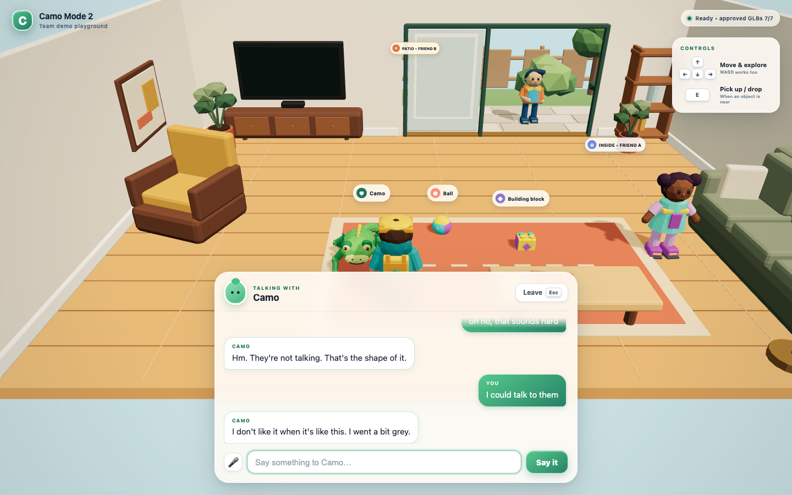
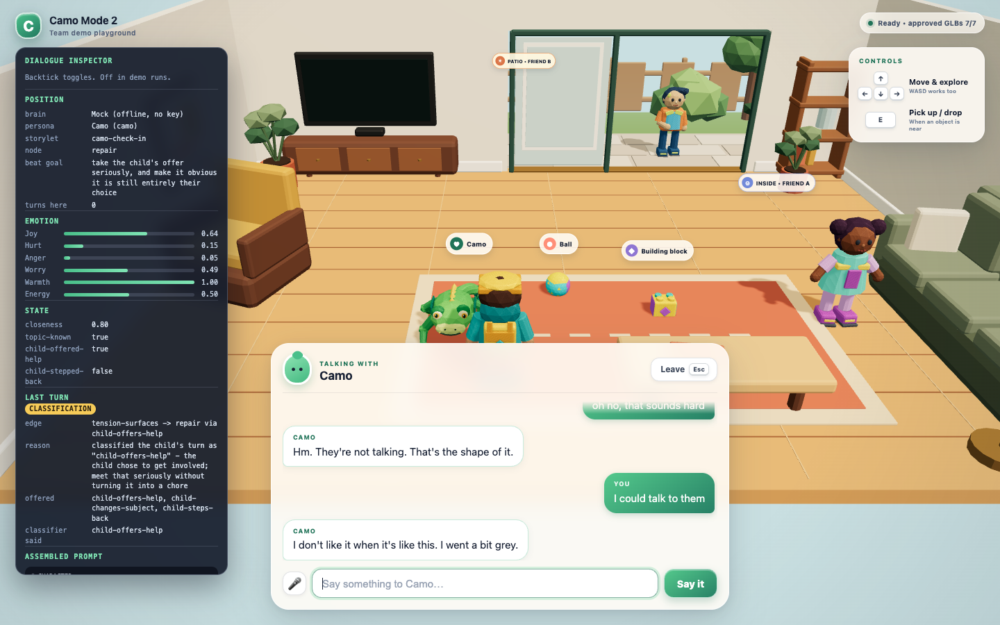

# Conversational-agent layer

The modular dialogue layer for Camo Mode 2. This document is the map: what the
interfaces are, how to swap a provider, where the authoring templates live, how
keys are kept out of the browser, and where the safety gate sits.

This is a **research slice**, built for swapping parts rather than for feature
volume. Every provider-specific detail sits behind an interface, and every piece
of authored content sits in `data/` rather than in TypeScript.

---

## Contents

| Concern | Interface | Implementations |
| --- | --- | --- |
| Chat completion | `ChatBrain` (`src/dialogue/providers/types.ts`) | mock, Anthropic, OpenAI, Groq, Cerebras, browser proxy |
| Personas | `Persona` (`src/dialogue/persona.ts`) | `data/personas/*.jsonc` |
| Story structure | `StoryletGraph` (`src/dialogue/storylet.ts`) | `data/storylets/*.jsonc` |
| Beat progression | `StoryletRuntime` (`src/dialogue/interpreter.ts`) | hybrid condition/classifier |
| Age band | `AudienceBand` (`src/dialogue/audience.ts`) | `data/audience.jsonc` |
| Safety | `ModerationProvider` (`src/dialogue/safety.ts`) | permissive, shield stub, none |
| Voice out | `VoicePlayer` (`src/dialogue/voice.ts`) | ElevenLabs via proxy |
| Voice in | `SpeechRecognizer` (`src/dialogue/speech.ts`) | Web Speech, proxy STT, null |
| Scene glue | `DialogueController` (`src/dialogue/controller.ts`) | one instance, owned by `app.ts` |

---

## Running it

```sh
npm install && npm run dev
```

**With no `.env` at all** the app is fully usable: the mock brain drives the
example storylet from authored offline lines, text streams, and voice is simply
off. That is the default path and it is what the unit tests exercise.

To go live, copy `.env.example` to `.env` and fill in what you have. `.env` is
gitignored.

---

## Provider abstraction

### The interface

`ChatBrain` in `src/dialogue/providers/types.ts`:

```ts
interface ChatBrain {
  readonly id: string;
  readonly label: string;
  readonly defaultParams: ModelParams;
  readonly available: boolean;
  stream(request: ChatRequest): AsyncIterable<ChatChunk>;
}
```

Two properties are load-bearing:

- **Streaming-first.** There is deliberately no `complete()`. The endgame is LPU
  inference where time-to-first-token is the point; an interface built around an
  awaited string would have to be torn up to get there. Callers that genuinely
  need a whole string (only the edge classifier does) use `collect()`.
- **Per-request params.** Model id, token ceiling, and sampling ride on the
  request, not on the adapter, so one adapter can serve dialogue and
  classification with different settings.

`ChatRequest.task` is `'dialogue' | 'classification'`, and `ChatRequest.json`
asks for a single JSON object. Adapters shape those natively: OpenAI-compatible
providers get `response_format: json_object`; Anthropic gets an assistant prefill
of `{`, which the adapter replays into the stream so the caller still receives a
parseable object.

### Selection

Selection is pure configuration, in `src/dialogue/providers/registry.ts`.
Precedence, highest first:

1. `CAMO_BRAIN` — an explicit pin (`mock`, `anthropic`, `openai`, `groq`, `cerebras`).
2. `GROQ_API_KEY`, then `CEREBRAS_API_KEY`.
3. `ANTHROPIC_API_KEY`, then `OPENAI_API_KEY`.
4. The mock. Always available, never needs a key.

The LPU adapters outrank the hosted APIs because they are the stated target
runtime: if a key for one is in `.env`, that is what is being evaluated. Pin
with `CAMO_BRAIN` to override. `CAMO_MODEL` overrides the model id for whichever
brain is active.

### Swapping to Groq or Cerebras

Both adapters are already written and wired (`src/dialogue/providers/lpu.ts`).
They ship as stubs only in the sense that, with no key, `stream()` throws
`BrainNotConfiguredError` naming the exact variable to set. Turning one on:

```sh
# .env
GROQ_API_KEY=gsk_...
CAMO_MODEL=gemma2-9b-it     # optional; defaults to llama-3.3-70b-versatile
```

Restart the dev server. **No code changes.** Both providers speak the OpenAI
`/chat/completions` wire format, so they reuse `OpenAICompatibleBrain` verbatim.

### Adding a brand-new provider

1. New file in `src/dialogue/providers/`. If it speaks the OpenAI wire format,
   delegate to `OpenAICompatibleBrain` and you are writing ~30 lines (see
   `openai.ts`). Otherwise implement `stream()` against `readServerSentEvents`.
2. Add its id to `BRAIN_IDS` and its env var to `BRAIN_KEY_VARS` in
   `registry.ts`, and add a `case` to `createBrain` and `defaultParamsFor`.
3. Document the variable in `.env.example`.

That is the whole surface. `tests/dialogue-providers.test.ts` asserts the
interface holds across all six implementations.

---

## Keys and the proxy

**No API key is reachable from browser-delivered code.** The mechanism:

- Every secret is read only by `server/env.ts`, via Vite's `loadEnv` at an empty
  prefix. Nothing is named `VITE_*` — that prefix is exactly what would push a
  value into client code.
- `server/dialogue-proxy.ts` is a Vite plugin declaring **server hooks only**
  (`configureServer`, `configurePreviewServer`). It is imported by
  `vite.config.ts` and by nothing under `src/`.
- `registry.ts` — the only module that names key variables and constructs keyed
  adapters — is imported *exclusively* by the proxy. It also never reads
  `process.env` itself; the environment is passed in as an argument.
- The browser uses `ProxyBrain`, which implements the same `ChatBrain` interface
  over `POST /__camo/chat`. It sends a prompt and receives text.

### Routes

| Route | Method | Purpose |
| --- | --- | --- |
| `/__camo/config` | GET | Capability report. Allow-listed fields; no key material. |
| `/__camo/chat` | POST | Streams the active brain's deltas back as SSE. |
| `/__camo/voice` | POST | Pipes ElevenLabs audio through, unbuffered. |
| `/__camo/stt` | POST | One-shot transcription of a recorded turn. |

The plugin is installed on the dev server **and** the preview server, so
`npm run preview` has the same capabilities as `npm run dev`.

### How this was verified

With every key set to a distinctive canary value in `.env`:

```sh
npm run build
grep -rI "LEAKCANARY" dist/                       # no matches
grep -roIE "ANTHROPIC_API_KEY|OPENAI_API_KEY|GROQ_API_KEY|CEREBRAS_API_KEY|ELEVENLABS_API_KEY|x-api-key|xi-api-key" dist/
                                                  # no matches
```

Neither the key values, the variable names, nor the provider auth headers appear
anywhere in the built bundle. `GET /__camo/config` was also checked against the
canary values and returns capability booleans only. Re-run this check after
touching anything under `server/` or `src/dialogue/providers/`.

---

## Personas

Schema in `src/dialogue/persona.ts`; authored files in `data/personas/`.
Template: **`data/templates/persona.template.jsonc`** — blank, heavily
commented, and deliberately outside every loader glob.

Each persona carries:

- **Identity** — name, age, background, role in scene, and speech texture
  (vocabulary level, sentence length, verbal tics, and what they never say).
- **Personality** — OCEAN traits as `{ value, note }`. The value is 0..1; the
  note is the author's sentence about how that trait shows up in *this*
  character.
- **Emotion baseline** — six dimensions, distinct from the traits.
- **Voice** — per-persona ElevenLabs voice id, so each character sounds distinct.
- **Boundaries, deflections, scene reactions, and offline lines.**

Shipped: `camo` (the most complete, since the Talk button targets whoever is
nearest and Camo starts beside the player), `friend-a`, `friend-b`.

### Traits become behaviour, never numbers

`src/dialogue/prompt.ts` bands each OCEAN value (very low / low / moderate /
high / very high) and looks up a concrete behavioural instruction, then appends
the author's note. The model is never shown a number:

```
agreeableness 0.85  ->  "Camo would rather sit in an awkward silence than make
                         anyone feel got at. In practice, you give in quickly to
                         keep the peace, even when you are hurt."
```

`tests/dialogue-prompt.test.ts` asserts no raw trait value ever appears in an
assembled prompt.

### Emotions

Six dimensions, defined once in `src/dialogue/emotion.ts`: `joy`, `hurt`,
`anger`, `worry`, `warmth`, `energy`. Each 0..1, each with an authored baseline
per persona and its own per-turn decay rate back toward that baseline. `warmth`
decays slowest on purpose — it is a relationship, not a mood.

Emotions move through storylet effects and through **scene reactions**: mood
shifts applied before the first word based on what is true in the room
(`carrying-ball`, `carrying-nothing`, `topic-known`, `first-meeting`,
`returning`, …). This is the seam between the existing pickup/drop gameplay and
the dialogue layer. It is load-bearing, not decorative: Friend B starts at 0.7
anger, the `carrying-ball` reaction adds 0.15, and the graph has a deterministic
guard that sends anyone at 0.75 or above straight to a "not now" beat. Walk up
to him holding the ball and he turns you away; put it down and he talks.

### Age band

`data/audience.jsonc` is the only place reading level is set. It carries
`activeBandId` plus band definitions (`maxSentenceWords`, `maxSentencesPerReply`,
vocabulary guidance, constructions to avoid). Retuning the whole cast for a
different age is one field.

Shipped default is **`5-7`**; `4-6` and `8-10` are provided for comparison. The
launch band is still an open captain decision.

---

## Storylet graph

Schema in `src/dialogue/storylet.ts`; authored graphs in `data/storylets/`.
Template: **`data/templates/storylet.template.jsonc`**.

A node is a beat, carrying a `beatGoal`, `constraints`, optional `onEnter` and
`onExit` effects, and its outgoing `edges`. An edge carries a `when` condition, a
`to` target, a `why` (shown verbatim in the inspector), and optional `effects`.

Conditions are either **deterministic** — `always`, `variable`, `emotion`,
`flag`, `turnsInNode`, and the `all` / `any` / `not` combinators — or the single
non-deterministic kind, `intent`, whose `description` tells a classifier what to
look for in the child's words.

Validation checks structure *and* referential integrity: every edge target must
be a real node, every variable and flag must be declared before use, ids must be
unique, and a node with no edges must be marked `terminal`. Errors name the file,
the field path, and what was expected, and all issues are reported at once.

The schema does not know about greetings, tension, or repair. The shipped
example (`data/storylets/camo-check-in.jsonc`) models that arc — approach,
greeting, topic raised, tension surfaces, the child responds, then repair /
deflection / withdrawal — but that arc is authored, not built in.

### The hybrid interpreter

`src/dialogue/interpreter.ts`. Per turn:

1. Increment the turn counter and decay the emotion vector toward baseline.
2. Evaluate every **deterministic** edge in authored order. First one true wins.
   No model call happens.
3. Only if none matched, collect this node's **intent** edges and hand *just
   those ids* to a small classification call.
4. Apply effects on transition: the old node's `onExit`, then the edge's
   `effects`, then the new node's `onEnter`.

**The classifier can never pick an edge the graph does not permit.** Its answer
is re-checked against the node's own edge list, so an id that is unknown, that
belongs to a different node, that is `none`, that is missing, or a call that
throws all resolve the same way: **stay on the current node**. It never guesses.
`tests/dialogue-interpreter.test.ts` pins every one of those paths.

The model sees only the current beat — never the graph, never the other nodes,
never where the conversation could go. That bound is what will keep a small open
model on the rails on the LPU path.

### Assembled prompt

`buildSystemPrompt` composes: identity, speech texture, banded trait behaviour,
the salient parts of the live emotion vector, this beat's goal and constraints,
optional scene state, the active age band's language rules, the non-negotiable
product rules, and the persona's own boundaries. History is bounded to the last
few exchanges.

The prompt carries two machine-readable markers (`# CHARACTER:`, `# BEAT:`) which
a real model reads as ordinary headings and which the keyless mock brain parses to
work out who is speaking and where.

---

## Safety seam

`src/dialogue/safety.ts`. Two hooks, both wired into `DialogueSession`:

- **`child-turn`** — runs before any prompt is assembled. On a block, no provider
  call is made and the graph does not move.
- **`character-reply`** — runs per completed sentence, before the text reaches
  the panel *or* the synthesizer. The gated sentence queue is what feeds both, so
  nothing can be spoken that was not checked.

On a block the character deflects using its own authored `deflections`. The child
never sees an error, a warning, or a moderation notice.

| Implementation | `CAMO_MODERATION` | Behaviour |
| --- | --- | --- |
| `PermissiveModeration` | *(default)* | Allows ordinary conversation including hard feelings; blocks only a child volunteering identifying details, and explicit self-harm or violent-harm content. |
| `ShieldModelModeration` | `shield` | Posts `{ stage, text, context }` to `MODERATION_ENDPOINT`, expects `{ allowed, category }`. Shaped for Llama Guard or comparable. **Fails closed** — a shield that errors or is unconfigured blocks, because the audience is children. |
| `NullModeration` | `none` | Never blocks. Persona tuning only; never ship it. |

Plugging in a real shield touches no dialogue code.

---

## Voice

**Out.** `src/dialogue/voice.ts` queues one gated sentence at a time to
`/__camo/voice`, which streams from ElevenLabs. Sentence one plays while
sentence two is still being generated, so playback starts long before the reply
is finished. Voice id and settings are per persona. There is a mute control in
the panel header, shown only when voice is actually available.

Every failure is silent to the child: a missing key, a failed request, or a
blocked autoplay leaves the text complete and unremarked. Voice is an
enhancement, never a dependency.

**In.** `src/dialogue/speech.ts` defines `SpeechRecognizer` with three
implementations: `BrowserSpeechRecognizer` (Web Speech API — no key, live
partials, audio stays local), `ProxySpeechRecognizer` (MediaRecorder to
`/__camo/stt`, transcribed server-side by ElevenLabs Scribe or Whisper), and
`NullSpeechRecognizer`. Selection prefers the browser adapter. The mic button is
off by default and hides entirely when no recognizer is available; the typed path
is complete on its own.

---

## Dialogue UI

`src/dialogue/ui/panel.ts` with the skeleton in `index.html` and styles in
`src/styles.css`, reusing the existing card language (papery translucent
surfaces, rounded corners, mint accents) rather than introducing a second visual
system. 15px body type, speaker name on every bubble, an animated thinking
state, streamed text, and a Leave control that is always one click or one Esc
away. The panel is kept deliberately short so the follow camera's framing of the
character stays visible above it.

Keystrokes inside the panel are stopped before they reach the movement handler,
so typing "we should walk sad" does not walk the avatar across the room. Held
movement keys are cleared when the panel takes focus.

Walking out of range (`LEAVE_RADIUS`, 3.4m) ends the conversation silently. There
is no nagging, no "come back", and no penalty. A character's position, mood, and
relationship variables survive; only the transcript starts fresh.



---

## Research inspector

`src/dialogue/ui/inspector.ts`. **Off by default**; toggle with the backtick key
or start with `?debug=1`. It must never be visible in a demo run.

Shows the active brain, the current node and its beat goal, turns spent there,
the live emotion vector as meters, every relationship variable and scene flag,
which edge fired last turn and *why* — tagged `condition` or `classification`,
with the authored reason, the ids offered to the classifier, and its raw answer —
and the full assembled prompt.



---

## Scene integration

`src/dialogue/controller.ts` is the only thing `app.ts` talks to. It offers the
Talk button when a character is within proximity, supplies the scene facts, opens
and closes sessions, and lifts conversation flags back into scene state so the
room can respond — once Camo has raised the falling out, the friends' proximity
prompts stop pretending nothing happened, while still handing the choice straight
back to the child.

`window.__CAMO_DEMO__.getState()` gains a `dialogue` block (brain, voice, STT,
open state, current node, last edge and how it was resolved, flags, variables,
load error). Every pre-existing field is unchanged.

---

## Testing

```sh
npm test        # 135 tests
npm run build
```

| File | Covers |
| --- | --- |
| `tests/dialogue-schema.test.ts` | JSONC parsing, persona/storylet/audience validation and error quality, templates blank and unloadable |
| `tests/dialogue-prompt.test.ts` | Trait-to-behaviour translation, one-beat isolation, age band, bounded history, classifier prompt |
| `tests/dialogue-interpreter.test.ts` | Condition evaluation, the hybrid rule, every classifier failure path, effects, emotion decay |
| `tests/dialogue-providers.test.ts` | Adapter selection, the interface across six implementations, wire formats, the LPU stubs, proxy behaviour |
| `tests/dialogue-safety.test.ts` | Sentence gating, permissive defaults, shield contract and fail-closed |
| `tests/dialogue-session.test.ts` | The full keyless pipeline through the example storylet, deflection paths, scene reactions |

---

## Known gaps

- **ElevenLabs voice ids are stock placeholders.** They sound nothing like the
  cast and must be replaced before any external showing.
- **Cast names are provisional.** Friend A speaks as Nell and Friend B as Theo in
  dialogue, while the scene labels remain "Friend A"/"Friend B".
- **The live-provider path is written and typed but has not been run against a
  real key** — none was available in this environment. See the report for the
  keys the captain needs to supply.
- **The friends' graph is shorter than Camo's** by design; if the captain wants
  the disagreement explored in more depth, that is graph authoring, not code.
